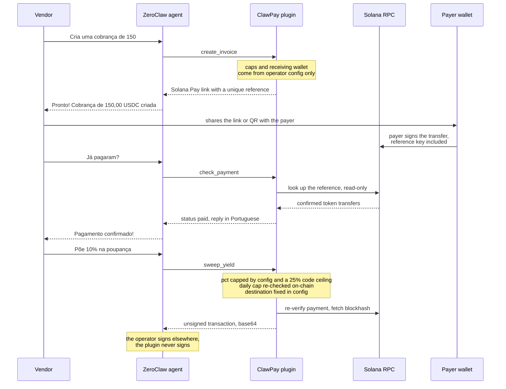

# ClawPay

Solana Pay stablecoin invoices for ZeroClaw agents.

ClawPay is a Solana-native WASM tool plugin for [ZeroClaw](https://github.com/zeroclaw-labs/zeroclaw) that turns any ZeroClaw agent into a payment terminal for Brazilian informal workers, gig workers and small merchants.

## What it does

Talking to their agent (typically over WhatsApp), a street vendor, delivery worker or freelancer can create a stablecoin invoice, check it on-chain, and get every answer in natural Brazilian Portuguese:

```text
> Cria uma cobrança de 150 pro Carlos, almoço

Pronto! Cobrança de 150,00 USDC criada.
Link de pagamento: solana:7VHU…?amount=150&spl-token=EPjF…&reference=8fJd…
Referência: CP-78432
Válida até 14:32 de 01/08/2026.

> Já pagaram a do almoço?

Pagamento confirmado!
Você recebeu 150,00 USDC.
Referência: CP-78432
Data: 01/08/2026 às 14:32.
Obrigado!
```

Pix runs Brazil's informal economy; ClawPay complements it rather than replacing it. It adds professional invoicing, automatic confirmation and dollar-denominated micro-savings on Solana rails, all through chat.

Amounts are denominated in the invoice token (USDC by default) and formatted Brazilian-style (`1.234,56`). Converting to and displaying BRL is the agent's job; the plugin never invents an exchange rate.

## Features

- **Stablecoin invoices**: Solana Pay link + QR content, USDC by default
- **On-chain payment detection** with confirmations in natural Brazilian Portuguese
- **Invoice status** for any invoice: paga, pendente, parcial ou expirada
- **Optional micro-savings**: sweep a hard-capped percentage of received funds into a pre-approved yield wallet ("reserva de rendimento")

## How it works



Statelessness is a design constraint of ZeroClaw tool plugins (fresh store per call), and ClawPay leans into it: the Solana Pay `reference` key **is** the invoice database. Nothing needs to be persisted; payment state is always re-derived from the chain.

## Custody model

ClawPay **never holds key material and has no signing path**. Its custody tiers, per feature:

| Action | Chain access | Custody tier |
|---|---|---|
| `create_invoice` | none (or read-only when a daily volume cap is set) | build payment request; the **payer** signs in their own wallet |
| `check_payment` | read-only JSON-RPC | read-only |
| `sweep_yield` | read-only JSON-RPC | **build unsigned transaction**, returned base64 for the operator's own signer |

Every limit is enforced **inside the plugin**, from operator config plus on-chain facts, and every failure path fails closed:

- **Per-invoice maximum** (`max_invoice_amount`, default 2 000): larger requests are refused in Portuguese.
- **Daily received-volume cap** (`daily_volume_cap`, optional): verified by scanning the chain, so the model cannot talk its way past it. If the RPC is unreachable, creation is refused, not waved through.
- **Sweep percentage**: runtime `pct` ≤ operator `max_sweep_pct` ≤ a **compiled-in ceiling of 25%**. Operator config can only lower the ceiling, never raise it.
- **Daily sweep cap** (`daily_sweep_cap`, default 500): measured against what the destination actually received today on-chain (deliberately conservative: inbound from any source counts).
- **Sweep only after confirmed payment**: the sweep re-verifies the invoice on-chain and sizes itself from the chain-verified received amount, never from what the model claims.
- **Yield destination is config-only**: there is deliberately no runtime parameter for it. Same for the receiving wallet: invoice `recipient` overrides are rejected unless the operator explicitly enables them, so a prompt-injected agent cannot redirect money.
- The model-facing schema never exposes `__config`; the ZeroClaw host additionally strips any caller-supplied `__config` before injection.

## Install

> `zeroclaw plugin ...` requires a ZeroClaw binary built with the plugin host, e.g. `cargo build --release --features plugins-wasm-cranelift` (the prebuilt release binaries ship without it).

```bash
./scripts/package.sh                      # builds dist/clawpay/
zeroclaw plugin install ./dist/clawpay/
zeroclaw config set plugins.enabled true
zeroclaw plugin list                      # should show clawpay 0.1.0
```

Then configure it (values are stored encrypted under the plugin's own config section and injected as `__config`; the plugin never reads env vars or global config):

```bash
zeroclaw config set plugins.entries.clawpay.recipient "<merchant wallet pubkey>"
zeroclaw config set plugins.entries.clawpay.rpc_url "https://api.mainnet-beta.solana.com"
# optional micro-savings:
zeroclaw config set plugins.entries.clawpay.yield_destination "<yield wallet pubkey>"
zeroclaw config set plugins.entries.clawpay.max_sweep_pct "15"
```

*(If your host version stores plugin config under a different key path, use the equivalent `zeroclaw config set` path for the `clawpay` section; the keys below are the contract.)*

## Configuration

All keys are optional except that **without `recipient` invoice creation refuses** (fail closed). An empty config is safe: sweeps disabled, overrides disabled, conservative caps.

| Key | Default | Meaning |
|---|---|---|
| `recipient` | (none) | Merchant wallet (base58). Invoices are payable to this address. |
| `rpc_url` | mainnet-beta public RPC | Solana JSON-RPC endpoint. |
| `allowed_tokens` | `USDC:EPjF…t1v:6` | Comma-separated `SYMBOL:MINT:DECIMALS`. First entry is the default token. |
| `max_invoice_amount` | `2000` | Per-invoice cap, token units. |
| `daily_volume_cap` | unset | Daily received-volume cap; enforced via chain scan when set. |
| `default_expiry_minutes` | `60` | Invoice validity when the request doesn't specify one. |
| `max_sweep_pct` | `0` (disabled) | Operator ceiling for sweeps; clamped to a hard 25%. |
| `daily_sweep_cap` | `500` | Absolute daily sweep cap, token units. |
| `yield_destination` | (none) | Pre-approved yield wallet. Sweeps refuse without it. Its token account must exist. |
| `allow_recipient_override` | `false` | Allow `create_invoice` to take a per-call recipient. Leave off. |
| `scan_limit` | `20` | Max signatures scanned per lookup (hard cap 100, bounds fuel use on small hosts). |
| `utc_offset_hours` | `-3` | Local timezone for "today" caps and message timestamps (Brasília). |
| `label` | `ClawPay` | Merchant label shown in the payer's wallet. |

For **devnet**, set `rpc_url` to `https://api.devnet.solana.com` and `allowed_tokens` to `USDC:4zMMC9srt5Ri5X14GAgXhaHii3GnPAEERYPJgZJDncDU:6`.

## Tool actions

One tool, `clawpay`, with an `action` parameter (ZeroClaw tool plugins export exactly one tool per component):

- `create_invoice`: `amount` (accepts `150`, `150,50`, `1.234,56`), optional `token`, `description`, `expiry_minutes`. Returns the Solana Pay URL (`url` / `qr_content`), the `reference` pubkey, a human `reference_id` (`CP-XXXXX`, also attached as the on-chain memo), `expires_at`, and `message_pt` ready to send.
- `check_payment`: `reference`, `expected_amount`, `expires_at` (all from the create output). Returns `paid | pending | partial | expired`, amounts, payer, signatures, timestamps, and `message_pt`. Detection matches token-balance deltas, so plain transfers, `transferChecked` and CPI-wrapped transfers all count; partial payments across several transactions are summed.
- `sweep_yield`: same lookup fields plus `pct`. On success returns `sweep_ready` with `unsigned_tx_base64` (a legacy-format SPL `TransferChecked`, empty signature slot, recent blockhash; sign and submit within roughly 1 to 2 minutes) and `message_pt` ("Separei 10% (15,00 USDC)...").

Refusals come back as a normal tool result with `success: false` and a Portuguese `message_pt` (e.g. *"Não consigo criar cobrança acima de 2.000,00 USDC. Pode diminuir o valor?"*), so the agent can relay them naturally instead of crashing the call.

## Development

Pure payments core (`src/core/`) with no wasm dependency; the component (`src/lib.rs`) is a thin shim that injects the real RPC client (via `wasi:http`/waki), entropy and clock. That split is what makes the whole decision surface natively testable:

```bash
cargo test           # 39 tests: money/date handling, wire format, status matrix,
                     # and every fail-closed path against a mocked chain
cargo clippy --all-targets
./scripts/package.sh # wasm32-wasip2 component + dist/ assembly
```

The vendored `wit/` directory is the ZeroClaw plugin ABI (`zeroclaw:plugin@0.1.0`, world `tool-plugin`); keep it in sync with the target host version. Structure follows the official [redact-text reference plugin](https://github.com/zeroclaw-labs/zeroclaw-plugins/tree/main/plugins/redact-text).

## Repository layout

```
manifest.toml        plugin manifest: capabilities=["tool"], permissions=["config_read","http_client"]
src/core/            pure logic: config, money, invoice, payment, chain flows, tx wire, pt-BR messages
src/lib.rs           WIT component glue (wasm-only)
tests/               native test suite with a programmable mock chain
scripts/package.sh   build + assemble dist/clawpay/
wit/                 vendored ZeroClaw plugin WIT contract (v0)
```
